# frontend-notes

## [Node notes](./NODE.md)

## 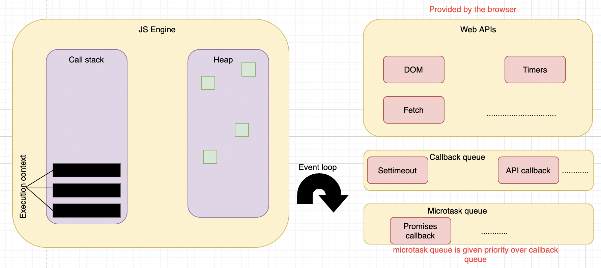

## 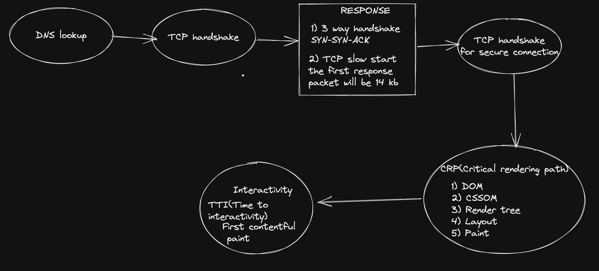


- [HTML](#html)
- [CSS](#css)
- [JS](#js)
- [React](#react)
- [Redux](#redux)
- [Design question and WEB](#design)
- [DS and ALGO](#dsandalgo)
- [Seo](#seo)
- [Web](#web)
- [Optimization](#optimization)


# Front end Interview Prep

SOLID stands for:

S - Single-responsiblity Principle
O - Open-closed Principle
L - Liskov Substitution Principle
I - Interface Segregation Principle
D - Dependency Inversion Principle

# HTML

- DOCTYPE is an abbreviation for Document Type. A DOCTYPE is always associated to a DTD - for Document Type Definition.
- For webpages, the DOCTYPE declaration is required. It is used to tell user agents what version of the HTML specifications your document respects. Once a user agent has recognized a correct DOCTYPE, it will trigger the no-quirks mode matching this DOCTYPE for reading the document. If a user agent doesn't recognize a correct DOCTYPE, it will trigger the quirks mode.

| div                                                                      | span                                                                                          |
| ------------------------------------------------------------------------ | --------------------------------------------------------------------------------------------- |
| The `<div>` tag is a block level element                                   | The `<span>` tag is an inline element.                                                          |
| It is best to attach it to a section of a web page.                      | It is best to attach a CSS to a small section of a line in a web page.                        |
| This tag should be used to wrap a section, for highligting that section. | This tag should be used to wrap any specific word that you want to highlight in your webpage. |

- Elements such as header, nav, section, article, aside, and footer act more or less like div elements. They group other elements together into page sections.

- Marquee is used for the scrolling text on a web page. It scrolls the image or text up, down, left or right automatically. You should put the text which you want to scroll within the `<marquee>……</marquee>` tag.

- An iframe is used to display a web page within a web page.

- To create a multicolor text, you can use `<font color =”color”> </font>` for the specific texts that you want to color.

- <!DOCTYPE html> is used to instruct the web browser about the HTML page.

https://www.freecodecamp.org/news/semantic-html5-elements/#:~:text=Semantic%20HTML%20elements%20are%20those,content%20that%20is%20inside%20them.

# CSS

- https://rananitesh99.medium.com/five-css-interview-questions-you-will-be-asked-every-time-72fff69ecde


- [Inline vs block element](https://www.smashingmagazine.com/2010/06/the-principles-of-cross-browser-css-coding/#understand-the-css-box-model)

- A block-level element is drawn as a block that stretches to fill the full width available to it i.e, the width of its container and will always start on a new line.
  Elements that are block-level by default: div, img, section, form, nav.

- Inline elements are drawn where they are defined and only take up space that is absolutely needed. The easiest way to understand how they work is to look at how text flows on a page.
  Examples of elements that are inline by default: span, b, strong, a, input.

## 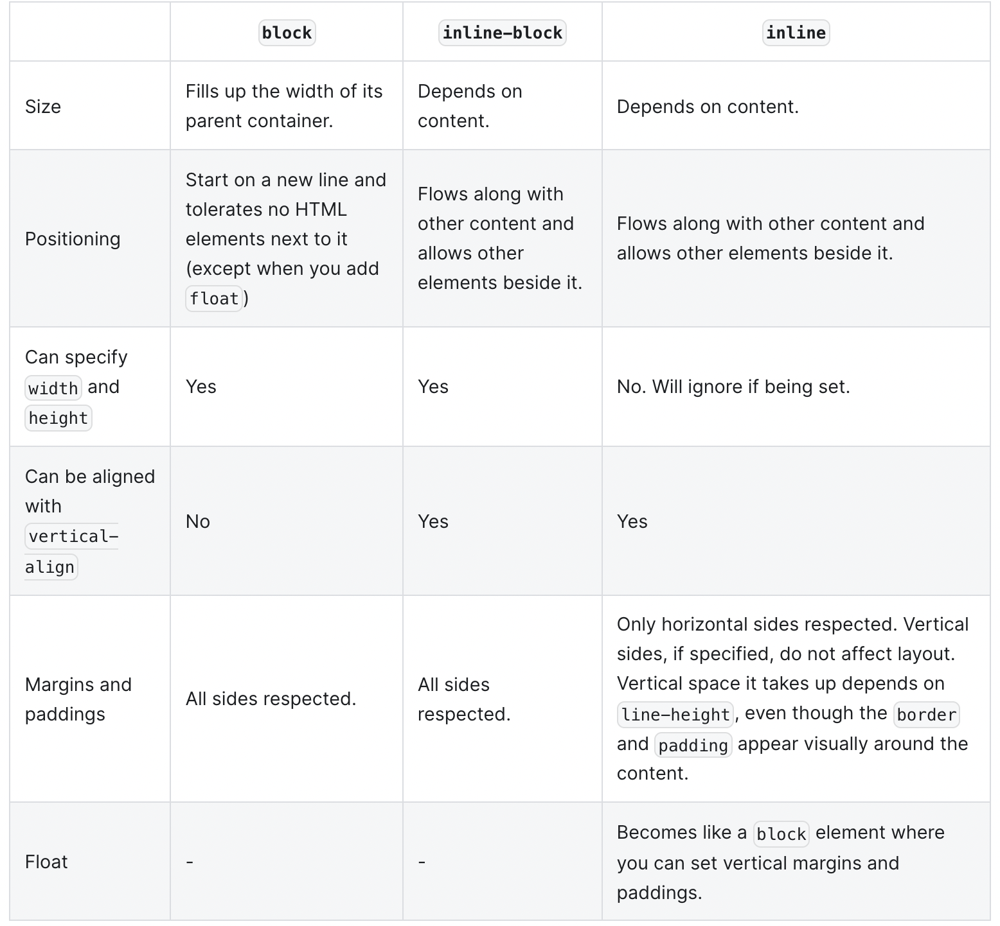

- The box-sizing property defines how the width and height of an element are calculated: should they include padding and borders, or not.

- content-box	Default. The width and height properties (and min/max properties) includes only the content. Border and padding are not included. 
- border-box	The width and height properties (and min/max properties) includes content, padding and border.
eg if width is 300px in border-box it will not add padding and margin

- Height is the vertical measurement of the container.
- **line-height** is the distance from the top of the first line of text to the top of the second. It is relevent when user might resize the text.
- If you wrap the text in a div, give the div a height, and the text grows to be 2 lines (perhaps because it is being viewed on a small screen like a phone) then the text will overlap with the elements below it. On the other hand, if you give the div a line-height and the text grows to 2 lines, the div will expand (assuming you don't also give the div a height).

* **display:none** means that the tag in question will not appear on the page at all (although you can still interact with it through the dom). There will be no space allocated for it between the other tags.

* **visibility:hidden** means that unlike display:none, the tag is not visible, but space is allocated for it on the page. The tag is rendered, it just isn't seen on the page.
  http://jsfiddle.net/burhans/ZVgJj/

  https://dev.to/prashantandani/quick-guide-to-css-units-px-em-rem-4lic

  https://www.youtube.com/watch?v=-GR52czEd-0

| px                                                                  | %                                    | vh / vw                          |
| ------------------------------------------------------------------- | ------------------------------------ | -------------------------------- |
| pixel is of absolute width, it will be same no matter where defined | % is based out of its parent element | 1vh = 1/100 of total screen size |

- rem is based put of root element
- em is based to near parent element

| pseudo class                                 | pseudo elements                                                 |
| -------------------------------------------- | --------------------------------------------------------------- |
| :                                            | ::                                                              |
| active, blank,checked,hover,focus, nth child | before, after, first line, first letter                         |
| active, blank,checked,hover,focus            | can be aplied to DOM elements with closing tags ie div,span etc |

> specificity

- Start at 0, add 1000 for style attribute, add 100 for each ID, add 10 for each attribute, class or pseudo-class, add 1 for each element name, tag name or pseudo-element.

```
A: h1
B: #content h1
C: <div id="content"><h1 style="color: #ffffff">Heading</h1></div>

The specificity of A is 1 (one element)
The specificity of B is 101 (one ID reference and one element)
The specificity of C is 1000 (inline styling)

Since 1 < 101 < 1000, the third rule (C) has a greater level of specificity, and therefore will be applied.
```
- One common use for display: inline-block is to display list items horizontally instead of vertically

## 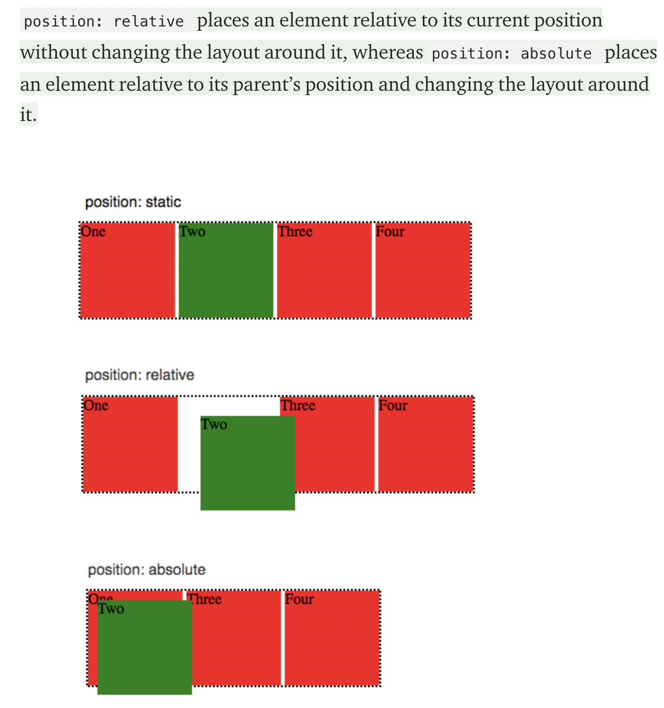
- Compared to display: inline, the major difference is that display: inline-block allows to set a width and height on the element.

- Also, with display: inline-block, the top and bottom margins/paddings are respected, but with display: inline they are not.

- Compared to display: block, the major difference is that display: inline-block does not add a line-break after the element, so the element can sit next to other elements.

## Responsive

## 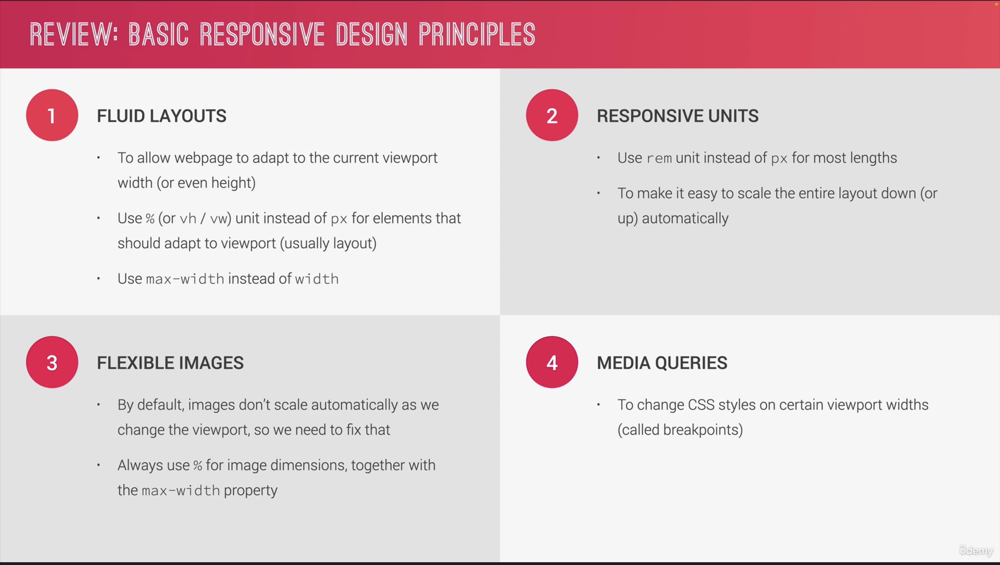

## Flex

## 


**scss vs css**

- Using SCSS we can declare variables
```
$theme_gray: gray;
$theme_black: black;
$theme_yellow: yellow;
$theme_white: white;
```

- SCSS uses nested syntax
```
.myclass {
    background-color: $theme_white;
    h1 {
        color: $theme_gray;
        text-align: center;
    }
    p {
        color: $theme_black;
    }
}

Replaces this:

.myclass {
    background-color: white;
}
.myclass h1 {
    color: gray;
    text-align: center;
}
.myclass p {
    color: black;
}
```
- SCSS has mixins
```
@mixin set-text-style($family:'Tahoma', $weight: 500, $style: normal, $color: black) {
    font-family: $family , 'Arial', 'Helvetica', sans-serif;
    font-style: $style;
    font-weight: $weight;
    color: $color;
}
h2 {
    @include set-text-style('Roboto', 600, 'italic', blue);
}
```

# JS

**ES2021**

- replaceAll

```
const fruits = '🍎+🍐+🍓+';
const fruitsWithBanana = fruits.replaceAll('+', '😇');
console.log(fruitsWithBanana); //🍎😇🍐😇🍓😇

```

- Logical assignment operator

```
a ||= b
// Equivalent to:
a || (a = b);

a &&= b
// Equivalent to:
a && (a = b);
```

- Numeric separators

```const amount = 12345_00;  // 12,345 (1234500 cents, apparently)
const amount = 123_4500;  // 123.45 (4-fixed financial)
const amount = 1_234_500; // 1,234,500
```

**spread and rest operator**
```
- spread operator unpacks the elements

const arr = [1,2,...[3,4]] //expands

- rest operator packs all the elements into an array
const [a,b, ...others] = [1,2,3,4,5]
```


**datatypes in JS**
- Numbers
- string
- boolean
- undefined
- null
- symbol
- bigInt

**es2016**
- let, const
- arrow function
- for/of
- classes
- spread and rest
- destructing
- map and set objects


- Array destructing
```
// Variable assignment.
const foo = ['one', 'two', 'three'];

const [one, two, three] = foo;
console.log(one); // "one"
console.log(two); // "two"
console.log(three); // "three"
```

- Object destructing
```
// Variable assignment.
const o = {p: 42, q: true};
const {p, q} = o;

console.log(p); // 42
console.log(q); // true
```

**Types of error**

## [Types of error](https://blog.bitsrc.io/types-of-native-errors-in-javascript-you-must-know-b8238d40e492)


**How JS works**

1. Everything inside JS happens in Execution context.
2. JS is synchronous single threaded language which means JS only execute one line at a time maintaing the order.
3. Inside EC we have two phase

- Memory creation(Variable environment) - allocates memory to all variables and function. Here the special keyword _undefined_ is assigned to variables declared using var keyword. For functions whole code is being assigned. Values are assigned in key value pair.
- Code Execution(Thread of execution) - Here JS skims through the code and work accordingly

4.  Wnenever we invoke a function EC is created.
5.  Call stack is the stack of EC.
6.  Global EC is created as soon as program is run.
7.  As soon as EC is created it is pushed into stack.
8.  As soon as EC is deleted it is popped out from stack.

**chaining assignments**

```
let a, b, c;

a = b = c = 2 + 2;

c = 2 + 2;
b = c;
a = c;
```

**copy objects**

```

const person = {
firstName: 'John',
lastName: 'Doe'
};

// using spread ...
let p1 = {
...person
};

// using Object.assign() method
let p2 = Object.assign({}, person);

// using JSON
let p3 = JSON.parse(JSON.stringify(person));

```

- Both spread (...) and Object.assign() perform a shallow copy while the JSON methods carry a deep copy.

```

let obj1 = {
fname: "amnah",
lname: "khatun",
address: {
city: "Jamshedpur"
}
};

let obj2 = { ...obj1 }; //shallow copy

obj2.fname = "elon";
obj2.address.city = "new york";
console.log(obj1, "obj1"); // { fname: 'amnah', lname: 'khatun', address: { city: 'new york' } }
console.log(obj2, "obj2"); // { fname: 'elon', lname: 'khatun', address: { city: 'new york' } }

```

- The **Object.freeze()** method freezes an object. A frozen object can no longer be changed; freezing an object prevents new properties from being added to it, existing properties from being removed.

```

const obj = {
prop: 42
};

Object.freeze(obj);

obj.prop = 33;
// Throws an error in strict mode

console.log(obj.prop);
// expected output: 42

```

- The Object.seal() method seals an object, preventing new properties from being added to it and marking all existing properties as non-configurable. Values of present properties can still be changed as long as they are writable.

```

const object1 = {
property1: 42
};

Object.seal(object1);
object1.property1 = 33;
console.log(object1.property1);
// expected output: 33

delete object1.property1; // cannot delete when sealed
console.log(object1.property1);
// expected output: 33

```

**Type coercion**

https://www.freecodecamp.org/news/js-type-coercion-explained-27ba3d9a2839/

- Type coercion is the process of converting value from one type to another (such as string to number, object to boolean, and so on).

_When a developer expresses the intention to convert between types by writing the appropriate code, like Number(value), it’s called explicit type coercion (or type casting)._

_Since JavaScript is a weakly-typed language, values can also be converted between different types automatically, and it is called implicit type coercion. It usually happens when you apply operators to values of different types, like
`1 == null, 2/’5', null + new Date(),` or it can be triggered by the surrounding context, like with `if (value) {…}`, where value is coerced to boolean._

_One operator that does not trigger implicit type coercion is ===, which is called the strict equality operator. The loose equality operator == on the other hand does both comparison and type coercion if needed_

**Promises**

https://medium.com/javascript-scene/master-the-javascript-interview-what-is-a-promise-27fc71e77261

- Promises are one of the ways we can deal with asynchronous operations in JavaScript.
- A promise is an object which can be returned synchronously from an asynchronous function. It will be in one of 3 possible states:

1. Fulfilled: onFulfilled() will be called (e.g., resolve() was called)
2. Rejected: onRejected() will be called (e.g., reject() was called)
3. Pending: not yet fulfilled or rejected

- The main difference between Callback Functions and Promises is that we attach a callback to a Promise rather than passing it.

```

const wait = time => new Promise(resolve => setTimeout(resolve, time));

wait(3000).then(() => console.log("Hello"));

```

Callback hell

```

firstRequest(function(response) {
  secondRequest(response, function(nextResponse) {
    thirdRequest(nextResponse, function(finalResponse) {
      console.log('Final response: ' + finalResponse);
    }, failureCallback);
  }, failureCallback);
}, failureCallback);

```

with promise

```

firstRequest()
.then(function(response) {
  return secondRequest(response);
}).then(function(nextResponse) {
  return thirdRequest(nextResponse);
}).then(function(finalResponse) {
  console.log('Final response: ' + finalResponse);
}).catch(failureCallback);

```

Promise with reject and resolve

```

let myPromise = new Promise((resolve, reject) => {
let condition;
if(condition is met){
    resolve('Success')
      } else {
        reject ('Rejection')
      }
})

myPromise.then(
(message)=>{console.log(message)
}).catch((error)=>{
console.log(error)
})

```

- async ensures that the function returns a promise.
- The keyword await makes JavaScript wait until that promise settles and returns its result.
- We may get this error if we forget to put async before a function. As stated earlier, await only works inside an async function.

* Promise.reject() returns a rejected promise.
* Promise.resolve() returns a resolved promise.
* Promise.race() takes an array (or any iterable) and returns a promise that resolves with the value of the first resolved promise in the iterable, or rejects with the reason of the first promise that rejects.
* Promise.all() takes an array (or any iterable) and returns a promise that resolves when all of the promises in the iterable argument have resolved, or rejects with the reason of the first passed promise that rejects.

**Event propagation**

https://medium.com/@marjuhirsh/event-propagation-event-delegation-7d3db1baf02a#:~:text=Event%20delegation%20takes%20advantage%20of,event%20listeners%20to%20specific%20nodes.&text=If%20a%20page%20would%20have,up%20a%20lot%20of%20memory.

Event propagation happen in 3 phases

1. Capturing
2. Target
3. Bubbling

there are two types of Event propagation

- Event bubbling (Goes from child to parent to grandparent, used by microsoft)
- Event capturing (Goes from grandparent to parent to child, used by netscape)
- If it’s false or omitted, then the handler is set on the bubbling phase.
- If it’s true, then the handler is set on the capturing phase.

```

document.querySelector('#button1).addEventListener('click', (e) => {
console.log('triggered)
}, true)

```

**This keyword**
- If the new keyword is used when calling the function, this inside the function is a brand new object.
- If apply, call, or bind are used to call/create a function, this inside the function is the object that is passed in as the argument.
- If a function is called as a method, such as obj.method() — this is the object that the function is a property of.
- If a function is invoked as a free function invocation, meaning it was invoked without any of the conditions present above, this is the global object. In a browser, it is the window object. If in strict mode ('use strict'), this will be undefined instead of the global object.
- If multiple of the above rules apply, the rule that is higher wins and will set the this value.
- If the function is an ES2015 arrow function, it ignores all the rules above and receives the this value of its surrounding scope at the time it is created.

- ES6 allows you to use arrow functions which uses the enclosing lexical scope. This is usually convenient, but does prevent the caller from controlling context via .call or .apply—the consequences being that a library such as jQuery will not properly bind this in your event handler functions. Thus, it's important to keep this in mind when refactoring large legacy applications.

**undefined vs null**

- A variable that is undefined is a variable that has been declared, but not assigned a value. It is of type undefined. If a function does not return any value as the result of executing it is assigned to a variable, the variable also has the value of undefined. To check for it, compare using the strict equality (===) operator or typeof which will give the 'undefined' string. Note that you should not be using the abstract equality operator to check, as it will also return true if the value is null.

- A variable that is null will have been explicitly assigned to the null value. It represents no value and is different from undefined in the sense that it has been explicitly assigned. To check for null, simply compare using the strict equality operator. Note that like the above, you should not be using the abstract equality operator (==) to check, as it will also return true if the value is undefined.


**Event delegation**

- Event delegation takes advantage of event propagation and so, allows the event listener to be set on a parent element.
- The blur, focus, load and unload events don’t bubble like other events.

**Chaining on conditional operator**

```

function dummy(param){
return condition1 ? value1
: condition2 ? value2
: condition3 ? value 3
: value4;
}

//same as
function dummy(param){
if(condition1){return value1;}
else if(condotion2){return value2};
else if(condotion3){return value3};
else {return value4}
}

```

**Call bind and apply**

- call and apply are used for function borrowing.
- We can borrow function from one object and use it with data of another object.

```

let obj1 = {
"fname" : "amnah,
"lname" : "khatun"
}

function printFullName(greet){
console.log(this.fname + this.lname + greet);
}

let obj2 = {
"fname" : "elon,
"lname" : "musk"
}

printFullName.call(obj1, "Hi")
printFullName.call(obj2, "Hello")
printFullName.apply(obj2, ["Hello")]

1st argument is reference to this
rest argument are parameter to function

- call and apply directly invokes the method

- bind returns the copy of the method which can be called later.
  let x = printFullName.bind(obj2, "Hola")
  -bind returns a function which can be invoked later

we can call bind using currying and closure

let add = function(a,b){
return a + b;
}

let addTwo = add.bind(this,2)
let addThree = add.bind(this,3)

```

**Hoisting**
- Hoisting is a term used to explain the behavior of variable declarations in your code. Variables declared or initialized with the var keyword will have their declaration "moved" up to the top of their module/function-level scope, which we refer to as hoisting. However, only the declaration is hoisted, the assignment (if there is one), will stay where it is.

- Variables declared via let and const are hoisted as well. However, unlike var and function, they are not initialized and accessing them before the declaration will result in a ReferenceError exception. The variable is in a "temporal dead zone" from the start of the block until the declaration is processed.

```

Lexical environment = local memory + lexical env of its parent

```

- lexical means heirarchy or in sequence
- inner function is lexically inside outer function

**Scope**

var - refers to same memory location
``` 
var b = 100;
{
var b =10;
console.log(b) ==> 10
}
console.log(b) ==> 10
shadows and update the global variable

let b = 200
{
let b = 20;
console.log(b) ==> 20 [Block memory space]
}
console.log(b) ==> 200 [script memory space]
```
let & const are stored in different memory location

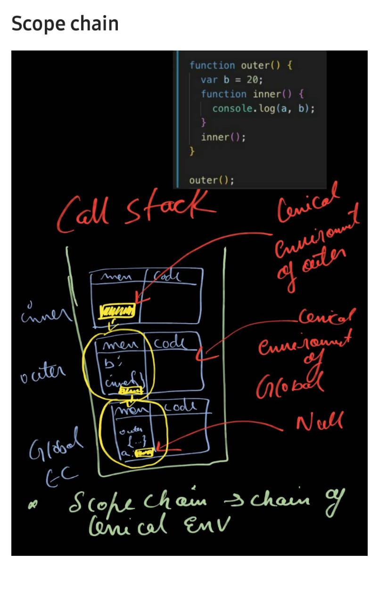

**closures**

- closure is function bundled together with its lexical environment.
- functions even after being returned remember their scope because of closure.
- function remembers the reference to the variable. 
- A closure is the combination of a function and the lexical environment within which that function was declared.

Use of closure

- Currying
- encapsulation
- memoize and once
- setTimeouts

**Currying**

- Currying is a technique of evaluating a function with multiple arguments into sequence of function with single/multiple argument.

https://codesandbox.io/s/css-html-flexbox-1jshh?file=/src/index.js

- Arrow functions don’t redefine the value of _this_ within their function body.

https://frontarm.com/james-k-nelson/when-to-use-arrow-functions/

**== vs ===**
- == is the abstract equality operator while === is the strict equality operator. The == operator will compare for equality after doing any necessary type conversions. The === operator will not do type conversion, so if two values are not the same type === will simply return false.

**same origin policy**
- The same-origin policy prevents JavaScript from making requests across domain boundaries. An origin is defined as a combination of URI scheme, hostname, and port number. This policy prevents a malicious script on one page from obtaining access to sensitive data on another web page through that page's Document Object Model.

**custom MAP method**

```

const arr = ["1","2","3"];
Array.prototype.myMap = function (cb){
let newArr = [];
for(let arr of this){
newArr.push(cb(arr))
}
return newArr;
}
arr.myMap((item) => console.log(item \* 2))

```

**custom REDUCE method**

```

Array.prototype.myReduce = function(callback, value) {
let a = this;
a.forEach(item => {
value = value !== undefined ? callback(value, item) : item;
});
return value;
};
let x1 = [1, 2, 3].myReduce(function(a, b) {
return a + b;
});
console.log(x1);

```

https://www.toptal.com/javascript/interview-questions

- factorial
  `console.log((function f(n){return ((n > 1) ? n * f(n-1) : n)})(10));`

> delete

> The code above will output `5` as output. When we used `delete` operator for deleting an array element then, the array length is not affected by this. This holds even if you deleted all elements of an array using `delete` operator.
> So when delete operator removes an array element that deleted element is no longer present in the array. In place of value at deleted index undefined x 1 in chrome and undefined is placed at the index.

```
Number + Number -> Addition
Boolean + Number -> Addition
Boolean + Boolean -> Addition
Number + String -> Concatenation
String + Boolean -> Concatenation
String + String -> Concatenation
```

- The nullish coalescing operator (??) is a logical operator that returns its right-hand side operand when its left-hand side operand is null or undefined, and otherwise returns its left-hand side operand
```
const foo = null ?? 'default string';
console.log(foo);
// expected output: "default string"

const baz = 0 ?? 42;
console.log(baz);
// expected output: 0
```

- The optional chaining operator (?.) enables you to read the value of a property located deep within a chain of connected objects without having to check that each reference in the chain is valid.

```
const adventurer = {
  name: 'Alice',
  cat: {
    name: 'Dinah'
  }
};

const dogName = adventurer.dog?.name;
console.log(dogName);
// expected output: undefined

console.log(adventurer.someNonExistentMethod?.());
// expected output: undefined
```

**Cookies**

- Has different expiration dates (both the server or client can set up expiration date)
- The Client can't access the Cookies if the HttpOnly flag is true
- Has SSL Support
- Data are transferred on each HTTP request
- 4kb limit

**Local Storage**

- Has no expiration date
- Client only
- Has no SSL support
- Data are not transferred on each HTTP request
- 5 mb limit (check with the browser)

**Session Storage**

- Data is gone when you close the browser tab
- Client only
- Has no SSL support
- Data are not transferred on each HTTP request
- 5-10 mb limit (check with the browser)

# React

## 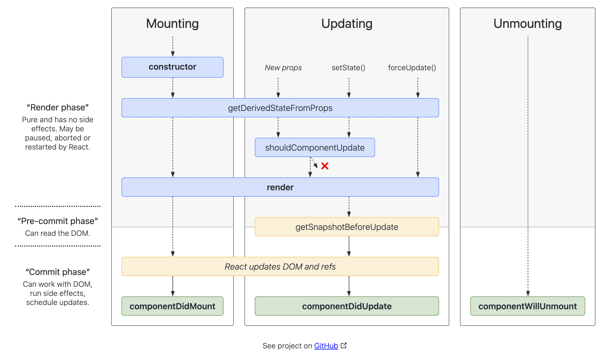


**props vs state**
| Props | state |
| ---- | ---------------- |
| Props are read only (immutable) |State can be modified using setState() |
| Props are used to pass data to components |State are maintained inside a component |

- React uses unidirectional data flow. Data can be passed from parent to child.
- Props can pass functions that may manipulate state. We can store the state in the parent and allow its child to use and manipulate the state.

- Difference between default export and named export.
- With Named export we can have multiple export in a single file.
- With default export we can have only one export in a single file.
- The naming of import is completely independent in default export and we can use any name we like.

- In summary, named exports are used to export multiple values.

- During the import, it will be possible to use the same name to refer to the exported value.

- Default exports are used to export a single value from the file.

- During the import, the name of the value can be different from the exported one.

**HOC**

https://codesandbox.io/s/a-simple-higher-order-component-forked-lk8gq?file=/index.js

- A HOC takes a component as input parameter and returns a new component.
- We don’t modify or mutate the component. We create new ones.
- A HOC is used to compose components for code reuse.
- A HOC is a pure function. That means it has no side effects. It only returns a new component.

```

const Hello = ({name}) => <h1>Hello {name}</h1>

function simpleHOC (WrappedComponent){
return class extends React.Component {
render(){
<WrappedComponent {...props}/>
}
}
}

const NewComponent = simpleHOC(Hello);

const App(){
<NewComponent name ="Hello" >
}

```

- Reuse component logic

```

const EnhancedComponent = higherOrderComponent(WrappedComponent);

```

https://www.smashingmagazine.com/2020/06/higher-order-components-react/

Eg of HOC

- PROVIDE COMPONENTS WITH SPECIFIC STYLING

#### Hooks

`const [count, setCount] = useState(0);`

- It combines the componentDidMount, componentDidUpdate and componentWillUnmount.

- To run the useEffect on first render and on every update, no need to pass 2nd argument.
- To call the method only when something changes, pass the second argument.
- to call the method only at first render pass []
- To mimic componentWillUnmount, useEffect may return a function that cleans up after it.
- We can have mutiple effects in the same component.

> useCallback and useMemo

- useCallback and useMemo both expect a function and an array of dependencies. The difference is that useCallback returns its function when the dependencies change while useMemo calls its function and returns the result.

https://medium.com/@jan.hesters/usecallback-vs-usememo-c23ad1dc60

### Redux

## 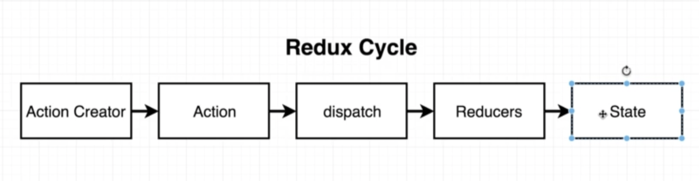
## 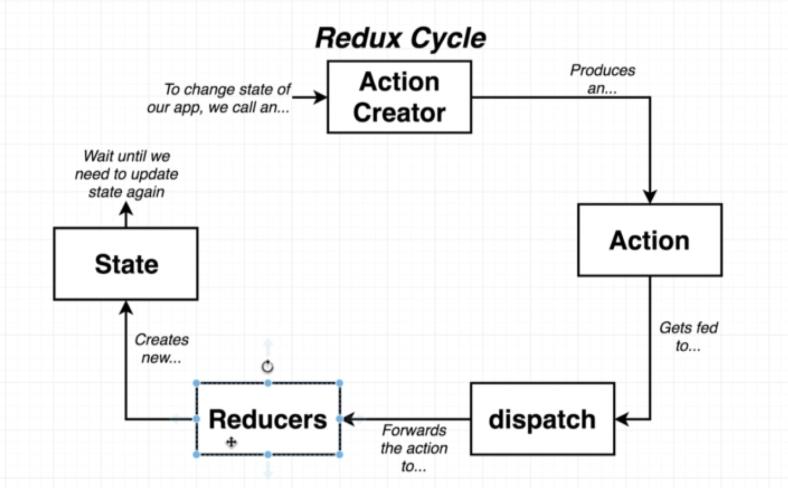
## 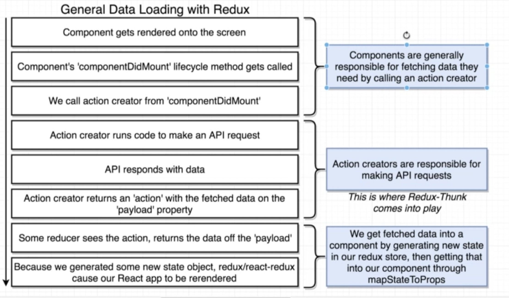

**core concept of redux**

- Single source of truth.
- State is read only(state can only be changed by dispatching action, and actions are objects).
- Pure reducers(reducers are pure function which based on the action return the updated state. Reducers cant modify the state they return the updated state object)
- Reducers are pure functions which specify how the application’s state changes in response to an ACTION. Reducers work by taking in the previous state and action, and then it returns a new state. It determines what sort of update needs to be done based on the type of action, and then returns new values. It returns the previous state as it is if no work needs to be done.

**error boundaries**

- Error boundaries are React components that catch JavaScript errors anywhere in their child component tree, log those errors, and display a fallback UI instead of the component tree that crashed. Error boundaries catch errors during rendering, in lifecycle methods, and in constructors of the whole tree below them.

- A class component becomes an error boundary if it defines either (or both) of the lifecycle methods static getDerivedStateFromError() or componentDidCatch(). Use static getDerivedStateFromError() to render a fallback UI after an error has been thrown. Use componentDidCatch() to log error information.

 **advantages of redux**

- Predictability of outcome: Since there is always one source of truth, i.e. the store, there is no confusion about how to sync the current state with actions and other parts of the application.

- Maintainability: It is simple to maintain a strict structure and predictable outcome.

- Server-side rendering: To the client-side, You just need to pass the store created on the server. This is helpful for initial render and provides a high-quality user experience as it optimizes the application performance.

- Developer tools: From actions to state changes, developers can track everything going on in the application in real-time.

- Community and ecosystem: Redux has a huge community behind it which makes it even more captivating to use. A large community of talented individuals contribute to the betterment of the library and develop various applications with it.

- Ease of testing: Redux’s code is mostly functions which are small, pure and isolated. This makes the code testable and independent.

- Organization: Redux is precise about how code should be organized, this makes the code more consistent and easier when a team works with it.


# DS and ALGO

> Big O Notation

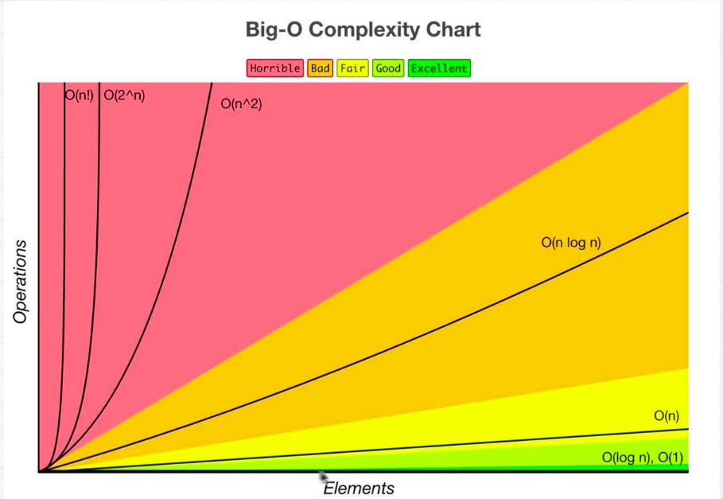

- `O(n) --> Linear time`
- `O(1) --> Constant time`
- `O(n^2) --> Quadratic time`

**Array**

```
let arr = ["😀", "😅", "😂", "🤣"];
arr.push("😍");
["😀", "😅", "😂", "🤣", "😍"]
---
arr.pop();
["😀", "😅", "😂"]
---
arr.shift();
["😅", "😂", "🤣"]
---
arr.unshift("😍");
["😍", "😀", "😅", "😂", "🤣"]
```

- push() --> push element at the end --> O(1)
- pop() --> remove element from the end --> O(1)
- shift() --> remove element from start --> O(n)
- unshift() --> add element at the start --> O(n)

_slice does not affect original array_
`array.slice(start, end)`

```
let arr = ["😀", "😅", "😂", "🤣"];
let temp = arr.slice(1,3);
console.log(arr); --> ["😀", "😅", "😂", "🤣"]
console.log(temp); --> ["😅", "😂"]
```

_splice delete or update value in an array_

> `array.splice(start, deleteCount, newElem1, newElem2, ..., newElemN)`

# System Design questions


**Optimization**
- Memoization (useMemo(), React.memo)
- React.Purecomponent. React.PureComponent optimizes our components by reducing the number of wasted renders.
- Lazy loading and suspense
- useCallback
- If you render large lists of data, it is recommended that you render only a small portion of the datasets at a time within the visible viewport of a browser, then the next data are rendered as the lists is scrolled, this is called “windowing”.

**Server sent events(SSE)**

- Server Sent Events are a standard allowing browser clients to receive a stream of updates from a server over a HTTP connection without resorting to polling. Unlike WebSockets, Server Sent Events are a one way communications channel - events flow from server to client only.

- You might consider using Server Sent Events when you have some rapidly updating data to display, but you don’t want to have to poll the server. Examples might include displaying the status of a long running business process, tracking stock price updates, or showing the current number of likes on a post on a social media network.

https://www.geeksforgeeks.org/what-is-web-socket-and-how-it-is-different-from-the-http/

- HTTP can run on the top of any reliable connection-oriented protocol such as TCP, SCTP. When a client sends HTTP request to the server, a TCP connection is open between the client and server and after getting the response the TCP connection gets terminated, each HTTP request open separate TCP connection to the server, for e.g. if client send 10 requests to the server the 10 separate HTTP connection will be opened. and get closed after getting the response/fallback.


**singleton design pattern**

- The singleton pattern is an often used JavaScript design pattern. It provides a way to wrap the code into a logical unit that can be accessed through a single variable. The Singleton design pattern is used when only one instance of an object is needed throughout the lifetime of an application. In JavaScript, Singleton pattern have many uses, they can be used for NameSpacing, which reduce the number of global variables in your page (prevent from polluting global space), organizing the code in a consistent manner, which increase the readability and maintainability of your pages.

- There are two important points in the traditional definition of Singleton pattern:

- There should be only one instance allowed for a class and
  We should allow global point of access to that single instance


### WEB


When you type a web address into your browser (for our analogy that's like walking to the shop):

1. The browser goes to the DNS server, and finds the real address of the server that the website lives on (you find the address of the shop).
2. The browser sends an HTTP request message to the server, asking it to send a copy of the website to the client (you go to the shop and order your goods). This message, and all other data sent between the client and the server, is sent across your internet connection using TCP/IP.
3. If the server approves the client's request, the server sends the client a "200 OK" message, which means "Of course you can look at that website! Here it is", and then starts sending the website's files to the browser as a series of small chunks called data packets (the shop gives you your goods, and you bring them back to your house).
4. The browser assembles the small chunks into a complete web page and displays it to you (the goods arrive at your door — new shiny stuff, awesome!).

## 

1. **DNS lookup** The first step of navigating to a web page is finding where the assets for that page are located. If you navigate to https://example.com, the HTML page is located on the server with IP address of 93.184.216.34.
2. **TCP handshake** Once the IP address is known, the browser sets up a connection to the server via a TCP three-way handshake.
    - TCP's three way handshaking technique is often referred to as "SYN-SYN-ACK"—or more accurately SYN, SYN-ACK, ACK—because there are three messages transmitted by TCP to negotiate and start a TCP session between two computers. Yes, this means three more messages back and forth between each server, and the request has yet to be made.
3. **TLS negotiation** For secure connections established over HTTPS, another "handshake" is required. This handshake, or rather the TLS negotiation, determines which cipher will be used to encrypt the communication, verifies the server, and establishes that a secure connection is in place before beginning the actual transfer of data. This requires three more round trips to the server before the request for content is actually sent.
4. **Response** Once we have an established connection to a web server, the browser sends an initial HTTP GET request on behalf of the user, which for websites is most often an HTML file.
    - This response for this initial request contains the first byte of data received. Time to First Byte (TTFB) is the time between when the user made the request—say by clicking on a link—and the receipt of this first packet of HTML. The first chunk of content is usually 14kb of data.
    - In TCP slow start, after receipt of the initial packet, the server doubles the size of the next packet to around 28Kb. Subsequent packets increase in size until a predetermined threshold is reached, or congestion is experienced.
5. **Parsing** Once the browser receives the first chunk of data, it can begin parsing the information received. Parsing is the step the browser takes to turn the data it receives over the network into the DOM and CSSOM, which is used by the renderer to paint a page to the screen.
    - Critical rendering path
        - DOM
            - preload scanner
            - While the browser builds the DOM tree, this process occupies the main thread. As this happens, the preload scanner will parse through the content available and request high priority resources like CSS, JavaScript, and web fonts. Thanks to the preload scanner, we don't have to wait until the parser finds a reference to an external resource to request it. It will retrieve resources in the background so that by the time the main HTML parser reaches requested assets, they may possibly already be in flight, or have been downloaded. The optimizations the preload scanner provides reduce blockages.
            - while the main thread is parsing the HTML and CSS, the preload scanner will find the scripts and image, and start downloading them as well. To ensure the script doesn't block the process, add the async attribute, or the defer attribute if JavaScript parsing and execution order is important.
        - CSSOM
        - render tree
            - Rendering steps include style, layout, paint and, in some cases, compositing. The CSSOM and DOM trees created in the parsing step are combined into a render tree which is then used to compute the layout of every visible element, which is then painted to the screen.
        - layout
        - paint
            - The last step in the critical rendering path is painting the individual nodes to the screen, the first occurrence of which is called the first meaningful paint. In the painting or rasterization phase, the browser converts each box calculated in the layout phase to actual pixels on the screen. Painting involves drawing every visual part of an element to the screen, including text, colors, borders, shadows, and replaced elements like buttons and images. The browser needs to do this super quickly.
   
- Time to Interactive (TTI) is the measurement of how long it took from that first request which led to the DNS lookup and SSL connection to when the page is interactive -- interactive being the point in time after the First Contentful Paint when the page responds to user interactions within 50ms.
- Browser initiate the request every time it finds limks to external resources in stylesheet, scripts etc.

-----------------------

- That changed around 2008 when IE introduced something they called “the lookahead downloader”. It was a way to keep downloading the files that were needed while the synchronous script was being executed. Firefox, Chrome and Safari soon followed, and today most browsers use this technique under different names. Chrome and Safari have “the preload scanner” and Firefox – the speculative parser.

- The **defer** and **async** attributes were introduced to give developers a way to tell the browser which scripts to handle asynchronously.

- Both of these attributes tell the browser that it may go on parsing the HTML while loading the script “in background”, and then execute the script after it loads. This way, script downloads don’t block DOM construction and page rendering. Result: the user can see the page before all scripts have finished loading.

- The difference between defer and async is which moment they start executing the scripts.
defer was introduced before async. Its execution starts after parsing is completely finished, but before the DOMContentLoaded event. It guarantees scripts will be executed in the order they appear in the HTML and will not block the parser.
- async scripts execute at the first opportunity after they finish downloading and before the window’s load event. This means it’s possible (and likely) that async scripts are not executed in the order in which they appear in the HTML. It also means they can interrupt DOM building.

Wherever they are specified, async scripts load at a low priority. They often load after all other scripts, without blocking DOM building. However, if an async script finishes downloading sooner, its execution can block DOM building and all synchronous scripts that finish downloading afterwards.

- you can now use `<link rel="preload">` to communicate to the browser that you want to load them as soon as possible.
- preload has other advantages too. Using as to specify the type of content to be preloaded allows the browser to:

- Prioritize resource loading more accurately.
- Store in the cache for future requests, reusing the resource if appropriate.
- Apply the correct content security policy to the resource.
- Set the correct Accept request headers for it.

- https://hacks.mozilla.org/2017/09/building-the-dom-faster-speculative-parsing-async-defer-and-preload/

- If your application renders long lists of data (hundreds or thousands of rows), we recommend using a technique known as **“windowing”**. This technique only renders a small subset of your rows at any given time, and can dramatically reduce the time it takes to re-render the components as well as the number of DOM nodes created.

- react-window and react-virtualized are popular windowing libraries. They provide several reusable components for displaying lists, grids, and tabular data.

- Windowing or List virtualization is a concept of only rendering or write the visible portion in the current “ window ” to the DOM. The number of items that rendered at first time are smaller than the original one

**DNS**

- A Domain Name System (DNS) translates a domain name such as www.example.com to an IP address.
- A time-to-live (TTL) determines how long content is cached
- DNS is hierarchical, with a few authoritative servers at the top level. Your router or ISP provides information about which DNS server(s) to contact when doing a lookup. Lower level DNS servers cache mappings, which could become stale due to DNS propagation delays. DNS results can also be cached by your browser or OS for a certain period of time, determined by the time to live (TTL).

**CDN**

- A content delivery network (CDN) is a globally distributed network of proxy servers, serving content from locations closer to the user. Generally, static files such as HTML/CSS/JS, photos, and videos are served from CDN, although some CDNs such as Amazon's CloudFront support dynamic content. The site's DNS resolution will tell clients which server to contact.

- Serving content from CDNs can significantly improve performance in two ways:

- Users receive content from data centers close to them
Your servers do not have to serve requests that the CDN fulfills

Benefits of CDN
- Improving website load times
- Reducing bandwidth costs 
- Increasing content availability and redundancy
- Improving website security

https://www.cloudflare.com/en-gb/learning/cdn/what-is-a-cdn/

**load balancer**

- Load balancers distribute incoming client requests to computing resources such as application servers and databases. In each case, the load balancer returns the response from the computing resource to the appropriate client. Load balancers are effective at:

- Preventing requests from going to unhealthy servers
- Preventing overloading resources
- Helping to eliminate a single point of failure

**Microservices**

- Related to this discussion are microservices, which can be described as a suite of independently deployable, small, modular services. Each service runs a unique process and communicates through a well-defined, lightweight mechanism to serve a business goal.

**RDBMS**

A relational database like SQL is a collection of data items organized in tables.

ACID is a set of properties of relational database transactions.

- Atomicity - Each transaction is all or nothing
- Consistency - Any transaction will bring the database from one valid state to another
- Isolation - Executing transactions concurrently has the same results as if the transactions were executed serially
- Durability - Once a transaction has been committed, it will remain so

There are many techniques to scale a relational database: master-slave replication, master-master replication, federation, sharding, denormalization, and SQL tuning.

- TCP is a connection-oriented protocol over an IP network. Connection is established and terminated using a handshake. All packets sent are guaranteed to reach the destination in the original order and without corruption

- TCP is useful for applications that require high reliability but are less time critical. Some examples include web servers, database info, SMTP, FTP, and SSH.

- UDP is connectionless. Datagrams (analogous to packets) are guaranteed only at the datagram level. Datagrams might reach their destination out of order or not at all. UDP does not support congestion control. Without the guarantees that TCP support, UDP is generally more efficient.

- UDP can broadcast, sending datagrams to all devices on the subnet. This is useful with DHCP because the client has not yet received an IP address, thus preventing a way for TCP to stream without the IP address.

- UDP is less reliable but works well in real time use cases such as VoIP, video chat, streaming, and realtime multiplayer games.

Use UDP over TCP when:

- You need the lowest latency
- Late data is worse than loss of data
- You want to implement your own error correction

**Mixins**

- a mixin is a class containing methods that can be used by other classes without a need to inherit from it.
- Some other languages allow multiple inheritance. JavaScript does not support multiple inheritance, but mixins can be implemented by copying methods into prototype.

**Factory function**

- https://www.javascripttutorial.net/javascript-factory-functions/
- The Object.create() method creates a new object using an existing object as the prototype of the new object
- A factory function is a function that returns a new object.
- Use Object.create() to create an object using an existing object as a prototype.
- By using the factory function, you create any number of the person objects without duplicating code.
```
function createPerson(firstName, lastName) {
  return {
    firstName: firstName,
    lastName: lastName,
    getFullName() {
      return firstName + ' ' + lastName;
    },
  };
}

let person1 = createPerson('John', 'Doe');
let person2 = createPerson('Jane', 'Doe');

console.log(person1.getFullName());
console.log(person2.getFullName());
```

**Singleton pattern**

- singleton pattern, it is, at its core, a design pattern that restricts the instantiation of a class to one object. Usually, the goal is to manage global application state. 
- https://www.sitepoint.com/javascript-design-patterns-singleton/

- This way is slightly more verbose than using an object literal, and our example is so simple that we don’t really see any benefits from using a class (though it will come in handy in the final example).

- One benefit to the class route that might not be obvious is that, if this is your front-end code, and your back end is written in C# or Java, you can employ a lot of the same design patterns in your client-side application as you do on the back end, and increase your team’s efficiency (if you’re small and people are working full-stack). Sounds soft and hard to measure, but I’ve experienced it firsthand working on a C# application with a React front end, and the benefit is real.

- It should be noted that, technically, the immutability and non-overridability of the singleton using both of these patterns can be subverted by the motivated provocateur. An object literal can be copied, even if it itself is const, by using Object.assign. And when we export an instance of a class, though we aren’t directly exposing the class itself to the consuming code, the constructor of any instance is available in JavaScript and can be invoked to create new instances. Obviously, though, that all takes at least a little bit of effort, and hopefully your fellow devs aren’t so insistent on violating the singleton pattern.


```
class UserStore {
  constructor(){
    this._data = [];
  }

  add(item){
    this._data.push(item);
  }

  get(id){
    return this._data.find(d => d.id === id);
  }
}

const instance = new UserStore();
Object.freeze(instance);

export default instance;
```

**facade pattern**

- https://www.educative.io/collection/page/5429798910296064/5725579815944192/6046230397321216
- a facade structural pattern provides a simpler interface that hides the complex functionalities of a system. This is widely used in JavaScript libraries like jQuery.

- The facade pattern allows you to hide all the messy logic from the client and only display the clear and easy to use interface to them. This allows them to interact with an API easily in a less error-prone way and without accessing the inner workings directly.

## 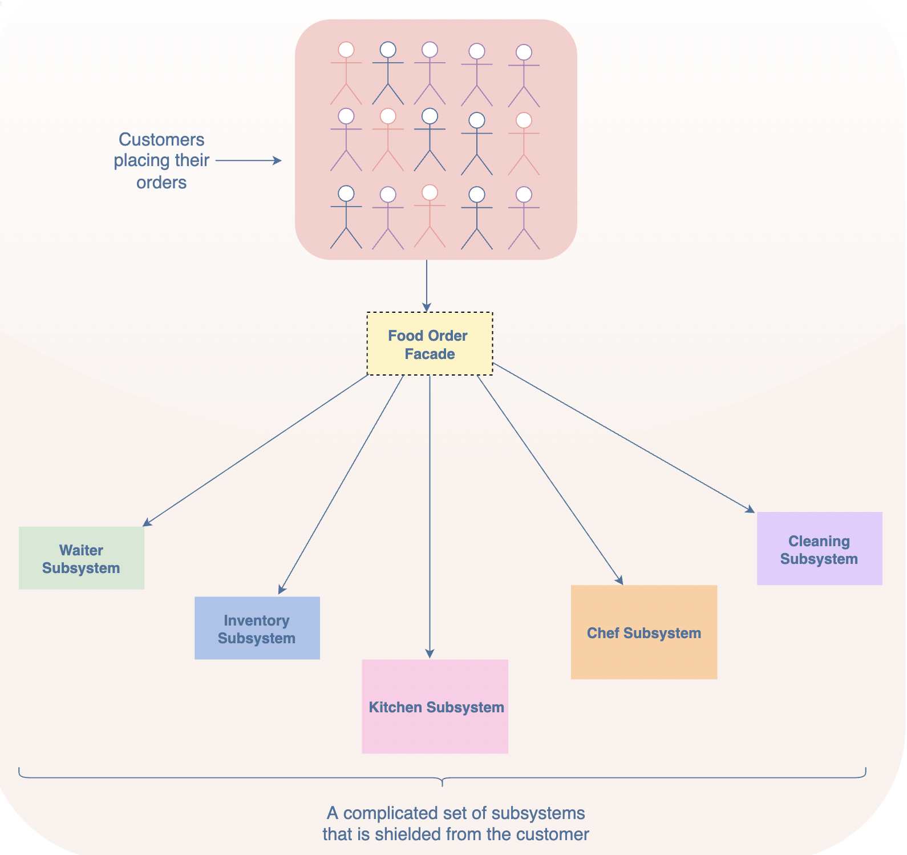

- The facade pattern is used to simplify a client’s interaction with a system. So it can be used when an application has a large and complex underlying code that the client does not need to see.

- It can also be used when you want to interact with the methods present in a library without knowing the processing that happens in the background. An example can be of the JavaScript libraries such as jQuery.


**SSL pinning**

- SSL pinning stands for Secure Socket Layer
- This connection ensures that all data passed between the web server and browsers remain private and integral
- SSL pinning allows the application to only trust the valid or pre-defined certificate or Public Key. The application developer uses SSL pinning technique as an additional security layer for application traffic.
- SSL Pinning is a technique that we use in the client side to avoid man-in-the-middle attack by validating the server certificates again even after SSL handshaking.

How SSL works?
- Client machine sends a connection request to server, server listens the request.
- Server gives response including public key and certificate.
- Client checks the certificate and sends a encrypted key to server.
- Server decrypt the key and sends encrypted data back to the client machine.
- Client receives and decrypt the encrypted data.

**An HTTP method is idempotent if an identical request can be made once or several times in a row with the same effect while leaving the server in the same state. In other words, an idempotent method should not have any side-effects (except for keeping statistics). Implemented correctly, the GET, HEAD, PUT, and DELETE methods are idempotent, but not the POST method. All safe methods are also idempotent.**

**HTTP codes**

- 1xx – Informational responses
- 2xx – Success
- 3xx – Redirection - These are used when the server found the requested resource somewhere else.
- 4xx – Client errors - These are used when the server received a wrong request
- 5xx – Server errors - When something wrong happens on the server, not because of client request data, but because of server state itself

- **Axios** automatically transforms the data returned from the server, but with fetch() you have to call the response.json method to parse the data to a JavaScript object.
- With Axios, the data response provided by the server can be accessed with in the data object, while for the fetch() method, the final data can be named any variable
- One of the key features of Axios is its ability to intercept HTTP requests. HTTP interceptors come in handy when you need to examine or change HTTP requests from your application to the server or vice versa (e.g., logging, authentication, or retrying a failed HTTP request).

- https://blog.logrocket.com/axios-vs-fetch-best-http-requests/


**Service worker**

- Rich offline experiences, periodic background syncs, push notifications—functionality that would normally require a native application—are coming to the web. Service workers provide the technical foundation that all these features rely on.

- In simple and plain words, it’s a script that browser runs in the background and has whatsoever no relation with web pages or the DOM, and provide out of the box features. It also helps you cache your assets and other files so that when the user is offline or on slow network.

- it therefore has no DOM access, and runs on a different thread to the main JavaScript that powers your app, so it is non-blocking. It is designed to be fully async; as a consequence, APIs such as synchronous XHR and Web Storage can't be used inside a service worker.

- Service workers only run over HTTPS, for security reasons. Having modified network requests, wide open to man in the middle attacks would be really bad

- [service worker important link](https://web.dev/learn/pwa/service-workers/)

- 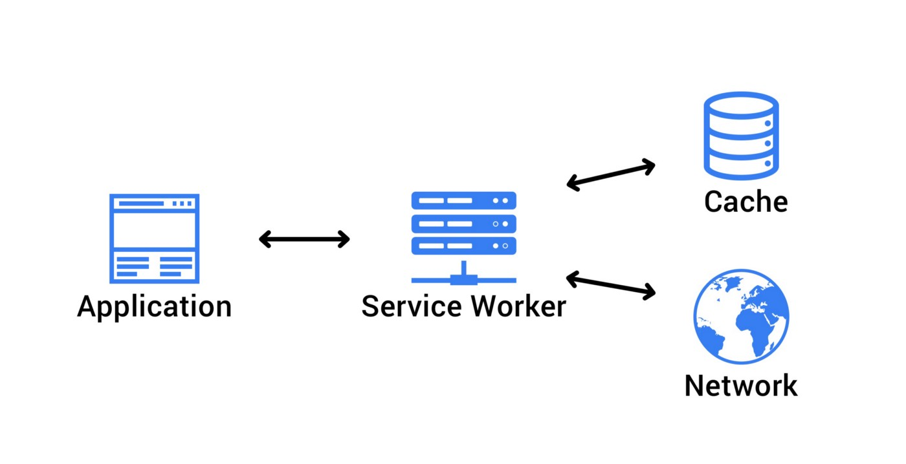

-  the Service Worker is a type of Web Worker

##### Usage of service worker

- Push notifications — allow users to opt-in to timely updates from web apps.
- Background sync — allows you to defer actions until the user has stable connectivity. This way, you can make sure that whatever the user wants to send, is actually sent.
- Periodic sync (future) — API that provides functionality for managing periodic background synchronization.
- Geofencing (future) — you can define parameters, also referred to as geofences which surround the areas of interest. The web app gets a notification when the device crosses a geofence, which allows you to provide useful experience based on the geography of the user.

##### Lifecycle of a Service Worker

The lifecycle of a service worker is completely separated from your web page one. It consists of the following phases:
- Download
- Installation
- Activation

**Web worker**

- Web Workers are a simple means for web content to run scripts in background threads. The worker thread can perform tasks without interfering with the user interface. In addition, they can perform I/O using XMLHttpRequest (although the responseXML and channel attributes are always null) or fetch (with no such restrictions).

`performance.now()` 

- Web Workers are in-browser threads that can be used to execute JavaScript code without blocking the event loop.

- Web Workers are not part of JavaScript, they’re a browser feature which can be accessed through JavaScript

https://blog.sessionstack.com/how-javascript-works-the-building-blocks-of-web-workers-5-cases-when-you-should-use-them-a547c0757f6a

**webpack**

- webpack is a static module bundler for modern JavaScript applications.
- Webpack is a bundler that uses a dependency graph to bundle our code and assets (incuding static assets such as images) into a ‘bundle’ which we can then deploy.

**websocket**
- The WebSocket API is an advanced technology that makes it possible to open a two-way interactive communication session between the user's browser and a server. With this API, you can send messages to a server and receive event-driven responses without having to poll the server for a reply.

- used in chat applications

# SEO

- The `<meta>` tag defines metadata about an HTML document. Metadata is data (information) about data.

- `<meta>` tags always go inside the <head> element, and are typically used to specify character set, page description, keywords, author of the document, and viewport settings.

- You can use the viewport meta tag to display the web pages correctly on mobile devices.
- Without a viewport meta tag, mobile browsers render the web pages at typical desktop screen widths, and then scale it down to fit the mobile screen. As a result, it requires pinch-and-zoom to view the web page properly in mobile devices, which is very inconvenient.

- They let you tell Google which version of a page they should index and rank, and where to consolidate any “link equity.”

- A canonical tag (rel=“canonical”) is a snippet of HTML code that defines the main version for duplicate, near-duplicate and similar pages. In other words, if you have the same or similar content available under different URLs, you can use canonical tags to specify which version is the main one and thus, should be indexed.

## Optimization

- 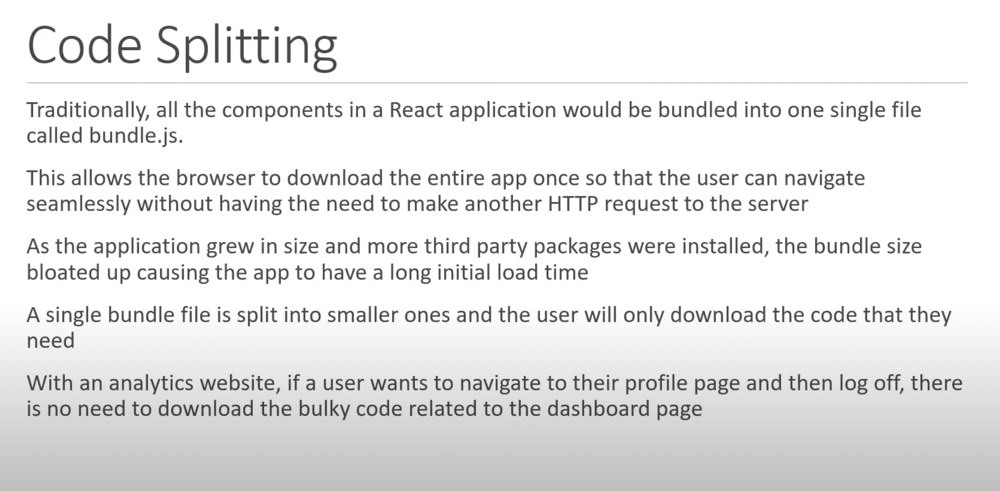
- picture element over img tag, lazy load the images


- What is windowing?
Windowing or List virtualization is a concept of only rendering or write the visible portion in the current “ window ” to the DOM. The number of items that rendered at first time are smaller than the original one.
The remaining items are rendered when you scroll down to it. The DOM nodes of items that exit the window are replaced by the new ones. This improves the performance of rendering a large list.
Without windowing, the entire list is written to the DOM including items that are not in the current window. It means, you would have to wait until the entire list is written to see the first item.